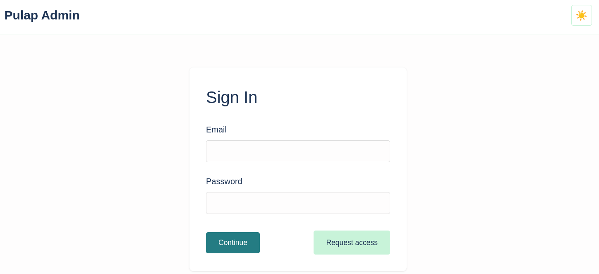

# Pulap

**Pulap** is an early-stage real estate management system developed as both a standalone project and a reference implementation for [HatMax](https://github.com/hatmaxkit/hatmax), a Go monorepo generator for microservices.  

This project emerged from two converging efforts: rethinking and reimplementing ideas drawn from past real estate software I’ve collaborated on, and using it as an exercise to distill and refine patterns that shape HatMax. The aim is to capture the most solid practices and architectural insights gathered across different projects, where each applied a different subset of good ideas, and consolidate them into a coherent, reproducible foundation.  

Building a generator like HatMax naturally involves building, in parallel, a concrete reference implementation. Pulap fulfills that role, focusing on the careful extraction, testing, and polishing of patterns before they are generalized into HatMax. The connection between both projects is simply factual: the same developer is exploring and refining the same body of ideas through two complementary paths.  

---

## Installation

### Clone
```bash
git clone https://github.com/pulap/pulap.git
cd pulap
```

### Run on Host
To quickly start all available services locally:
```bash
make run-all
```

This command builds all components and starts the local stack (Admin, AuthN, AuthZ, Estate).  
Logs for each service are stored in their respective folders under `services/`.  
On the first run, the console will display the generated user and password to access the interface and explore the current implementation.  

If running without Docker Compose, ensure a local MongoDB instance is available on the host.  

### Run with Docker Compose
To launch the current compose stack (including MongoDB and dependent services):
```bash
make run-compose
```

For a cleaner log output:
```bash
make run-compose-neat
```

To stop and remove the stack:
```bash
make stop-compose
```

The containerized setup automatically provisions its own MongoDB image and will also display the generated access credentials on first run.

### Run with Nomad
Nomad support uses the job files under `deployments/nomad/jobs/` and defaults to the local image names generated by Docker Compose (`pulap-authn:latest`, etc.).

1. Build the images you want to deploy (for local work `docker compose -f deployments/docker/compose/docker-compose.yml build` is enough).
2. Start a Nomad agent (for local testing: `nomad agent -dev -bind=0.0.0.0`).
3. Submit the jobs with `make nomad-run`. If you pushed images to a registry, override `NOMAD_AUTHN_IMAGE`, `NOMAD_AUTHZ_IMAGE`, `NOMAD_ESTATE_IMAGE`, or `NOMAD_ADMIN_IMAGE` (e.g. `make nomad-run NOMAD_AUTHN_IMAGE=registry.example.com/team/authn:1.0.0`).

The services run on the host network, mirroring the Compose ports (`admin` on 8081, `authn` on 8082, etc.), so ensure those ports are available on the target nodes.

To stop everything: `make nomad-stop`.

In CI/CD pipelines set `NOMAD_ADDR` and the relevant `NOMAD_*_IMAGE` variables before invoking `make nomad-run` so the job uses the artifacts published during the build stage.

<p align="center">
  
</p>
