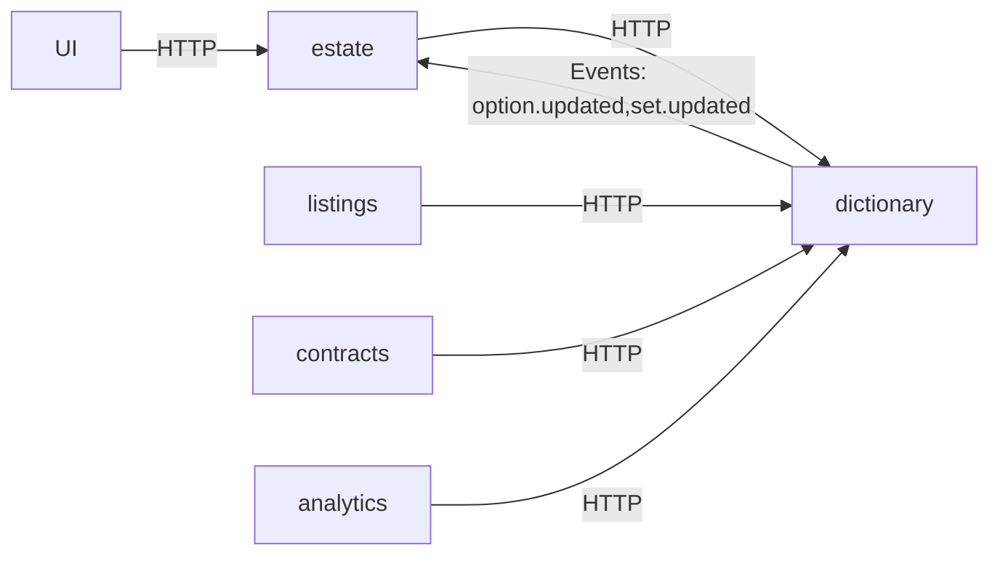

# ADR: Dictionary Service and Hierarchical Taxonomy for Real Estate (Go, microservices)

## Status
Accepted — initial rollout with the `estate` service (v0.3).

## Context
Our previous implementation stored a single “real_estate_type” dictionary. That approach is insufficient for real-world real estate classification where users navigate broad categories (e.g., Residential) down to common types (House, Apartment) and, when needed, precise subtypes (Bungalow, Loft, Data center).  
We are moving to Go-based microservices. The `estate` service (HTTP + chi, repositories for Mongo/SQLite, koanf config, telemetry) is already running and **must** consume a dedicated **Dictionary** microservice instead of embedding dictionaries locally.

Key goals:
- Provide a **three-level taxonomy**: `estate_category` → `estate_type` → `estate_subtype`.
- Keep **Sets** flat (conceptual containers) and model **hierarchy in Options** via `parent_id`.
- Expose **HTTP APIs** for read/write and **events** for cache invalidation.
- Make `estate` validate and persist **references** to dictionary entries (IDs), not labels.

## Decision
1. Create a new **Dictionary** microservice (Go) with two entities:
   - **Set**: a named dictionary container (e.g., `estate_category`, `estate_type`, `estate_subtype`).
   - **Option**: a value in a Set, optionally linked to a **parent Option** (`parent_id`) to express hierarchy.
2. `estate` stores **three foreign references** to dictionary options: `category_id`, `type_id`, `subtype_id`. It does not replicate dictionary data.
3. UI flows cascade: select Category → filter Types by `parent_id` → filter Subtypes by `parent_id`.
4. Caching in `estate` is **read-through** with **event-based** invalidation (PubSub abstraction: default SQLite backend, future NATS).

## Architecture (bounded contexts)
- **dictionary** (new microservice): owns Sets/Options, APIs, events, and seeding.
- **estate** (existing): owns Estates/Properties and uses dictionary IDs. Performs validation against dictionary.
- Future contexts that may consume dictionary:
  - **listings** (publishing), **contracts** (legal docs), **valuation** (pricing), **analytics** (rollups).



## Data model (Dictionary service)

### SQL (SQLite/PostgreSQL compatible)
```sql
-- sets
CREATE TABLE sets (
  id          TEXT PRIMARY KEY,            -- uuid
  name        TEXT NOT NULL UNIQUE,        -- e.g., "estate_category"
  label       TEXT NOT NULL,               -- human name (i18n key friendly)
  description TEXT,
  active      BOOLEAN NOT NULL DEFAULT 1,
  created_at  TIMESTAMP NOT NULL DEFAULT CURRENT_TIMESTAMP,
  updated_at  TIMESTAMP NOT NULL DEFAULT CURRENT_TIMESTAMP
);

-- options
CREATE TABLE options (
  id          TEXT PRIMARY KEY,            -- uuid
  set_id      TEXT NOT NULL REFERENCES sets(id) ON DELETE CASCADE,
  parent_id   TEXT NULL REFERENCES options(id) ON DELETE SET NULL,
  short_code  TEXT NOT NULL,               -- for compact URLs/keys
  key         TEXT NOT NULL,               -- stable developer-facing key
  label       TEXT NOT NULL,               -- human-facing label
  description TEXT,
  value       TEXT NOT NULL,               -- canonical value (same as key, or numeric if needed)
  "order"     INTEGER NOT NULL DEFAULT 0,
  active      BOOLEAN NOT NULL DEFAULT 1,
  created_at  TIMESTAMP NOT NULL DEFAULT CURRENT_TIMESTAMP,
  updated_at  TIMESTAMP NOT NULL DEFAULT CURRENT_TIMESTAMP,
  UNIQUE (short_code, set_id),
  UNIQUE (key, set_id)
);

CREATE INDEX idx_options_set_id    ON options(set_id);
CREATE INDEX idx_options_parent_id ON options(parent_id);
```

### Go domain types (Dictionary)
```go
type Set struct {
    ID          uuid.UUID `json:"id"`
    Name        string    `json:"name"`       // "estate_category", "estate_type", "estate_subtype"
    Label       string    `json:"label"`
    Description string    `json:"description,omitempty"`
    Active      bool      `json:"active"`
    CreatedAt   time.Time `json:"created_at"`
    UpdatedAt   time.Time `json:"updated_at"`
}

type Option struct {
    ID          uuid.UUID  `json:"id"`
    SetID       uuid.UUID  `json:"set_id"`
    ParentID    *uuid.UUID `json:"parent_id,omitempty"`
    ShortCode   string     `json:"short_code"`
    Key         string     `json:"key"`
    Label       string     `json:"label"`
    Description string     `json:"description,omitempty"`
    Value       string     `json:"value"`
    Order       int        `json:"order"`
    Active      bool       `json:"active"`
    CreatedAt   time.Time  `json:"created_at"`
    UpdatedAt   time.Time  `json:"updated_at"`
}
```

## Seed data

### YAML (authoritative seed for the Dictionary service)
```yaml
sets:
  - name: estate_category
    label: Estate Category
  - name: estate_type
    label: Estate Type
  - name: estate_subtype
    label: Estate Subtype

options:
  estate_category:
    - key: residential
      short_code: res
      label: Residential
      value: Residential
    - key: commercial
      short_code: com
      label: Commercial
      value: Commercial
    - key: land
      short_code: land
      label: Land
      value: Land
    - key: agricultural
      short_code: agr
      label: Agricultural
      value: Agricultural
    - key: mixed_use
      short_code: mix
      label: Mixed-use
      value: Mixed-use
    - key: special_purpose
      short_code: spc
      label: Special Purpose
      value: Special Purpose

  estate_type:
    - key: house
      short_code: house
      label: House
      value: House
      parent: residential
    - key: apartment
      short_code: apt
      label: Apartment
      value: Apartment
      parent: residential
    - key: office
      short_code: off
      label: Office
      value: Office
      parent: commercial
    - key: retail
      short_code: rtl
      label: Retail
      value: Retail
      parent: commercial

  estate_subtype:
    - key: bungalow
      short_code: bglw
      label: Bungalow
      value: Bungalow
      parent: house
    - key: loft
      short_code: loft
      label: Loft
      value: Loft
      parent: apartment
    - key: showroom
      short_code: shw
      label: Showroom
      value: Showroom
      parent: retail
```

### JSON (hierarchical view for docs/clients)
```json
{
  "Residential": {
    "House": ["Detached house","Semi-detached house","Bungalow","Ranch-style home","Cottage","Chalet","Cabin","Eco-home","Smart home"],
    "Apartment": ["Studio apartment","Basement apartment","Penthouse","Loft","Condominium","Co-op unit"],
    "Multi-unit": ["Duplex","Triplex","Fourplex","Townhouse","Row house"]
  },
  "Commercial": {
    "Office": ["Office building","Executive suite","Co-working space"],
    "Retail": ["Retail store","Shopping mall","Strip mall","Showroom"]
  },
  "Land": {
    "Urban": ["Residential lot","Commercial lot","Corner lot","Infill lot"],
    "Rural": ["Agricultural land","Timberland","Grazing land","Undeveloped land"],
    "Waterfront": ["Beachfront lot","Lakefront lot","Riverfront lot"],
    "Special": ["Mountain land","Desert land","Raw land","Improved land"]
  }
}
```

## Dictionary service API (HTTP)

### Endpoints
```
GET    /api/sets
POST   /api/sets
GET    /api/sets/{name}             # e.g., estate_category
GET    /api/sets/{name}/options
POST   /api/sets/{name}/options

GET    /api/options/{id}
GET    /api/options/{id}/children
PATCH  /api/options/{id}
DELETE /api/options/{id}
```

### OpenAPI excerpt
```yaml
openapi: 3.0.3
info:
  title: Dictionary Service
  version: "1.0"
paths:
  /api/sets/{name}/options:
    get:
      summary: List options in a Set
      parameters:
        - in: path
          name: name
          required: true
          schema: { type: string }
        - in: query
          name: parent_id
          schema: { type: string, format: uuid }
      responses:
        "200":
          description: OK
          content:
            application/json:
              schema:
                type: array
                items:
                  $ref: "#/components/schemas/Option"
components:
  schemas:
    Option:
      type: object
      properties:
        id: { type: string, format: uuid }
        set_id: { type: string, format: uuid }
        parent_id: { type: string, format: uuid, nullable: true }
        key: { type: string }
        short_code: { type: string }
        label: { type: string }
        value: { type: string }
        order: { type: integer }
        active: { type: boolean }
```

## Events (Pub/Sub)
Publish on updates to invalidate downstream caches:
- Topic: `dictionary.option.updated`
- Payload:
```json
{
  "id": "6b1e9a2d-3b8b-4a8d-9a7e-0f2a7b5d9e10",
  "set": "estate_type",
  "key": "house",
  "parent_id": "cb6b3f44-2f1a-4f29-9f0a-7bdb51b6e0e4",
  "active": true,
  "updated_at": "2025-10-28T12:34:56Z"
}
```
Default transport: **SQLite-based** message log (fits single-tenant); pluggable **NATS** backend for scale.

## Estate service integration (Go)

### 1) Domain change: add classification to Estate
Add a value object for classification and store IDs only.

```go
// internal/estate/classification.go
package estate

import "github.com/google/uuid"

type Classification struct {
    CategoryID uuid.UUID `json:"category_id"`
    TypeID     uuid.UUID `json:"type_id"`
    SubtypeID  uuid.UUID `json:"subtype_id"`
}
```

Extend aggregate:
```go
type Estate struct {
    // ... existing fields ...
    Classification Classification `json:"classification"`
}
```

### 2) Handler: validate against Dictionary service
- On Create/Update, call Dictionary to validate that:
  - `Type.parent_id` = selected Category
  - `Subtype.parent_id` = selected Type
- Reject if inconsistent.

```go
// pseudo-client usage in handler
ok, err := dictClient.ValidateClassification(ctx, estate.Classification)
if err != nil { /* 502/504 */ }
if !ok { /* 400 with validation errors */ }
```

### 3) Dictionary client (estate)
```go
type DictionaryClient interface {
    GetOption(ctx context.Context, id uuid.UUID) (*OptionDTO, error)
    ListOptionsByParent(ctx context.Context, setName string, parentID *uuid.UUID) ([]OptionDTO, error)
    ValidateClassification(ctx context.Context, c Classification) (bool, []string, error)
}
```

Minimal HTTP client:
```go
type httpDictionaryClient struct {
    baseURL string
    http    *http.Client
}

func (c *httpDictionaryClient) GetOption(ctx context.Context, id uuid.UUID) (*OptionDTO, error) {
    req, _ := http.NewRequestWithContext(ctx, "GET", c.baseURL+"/api/options/"+id.String(), nil)
    resp, err := c.http.Do(req)
    // ... decode JSON into OptionDTO
    return &dto, nil
}
```

### 4) Caching in estate
- In-memory LRU keyed by `option_id` and `set:name+parent_id`.
- Invalidate on `dictionary.option.updated` event.

### 5) Persistence in estate
No new tables needed if you store only IDs inside the aggregate JSON (Mongo) or columns in SQL. For SQLite path in `estate`, add columns if you persist normalized tables.

**SQLite example (estate side):**
```sql
ALTER TABLE estates ADD COLUMN category_id TEXT;
ALTER TABLE estates ADD COLUMN type_id TEXT;
ALTER TABLE estates ADD COLUMN subtype_id TEXT;
CREATE INDEX idx_estates_category ON estates(category_id);
CREATE INDEX idx_estates_type ON estates(type_id);
CREATE INDEX idx_estates_subtype ON estates(subtype_id);
```

### 6) UI flow (for reference)
1. Load categories: `GET /api/sets/estate_category/options`
2. On category select, load types: `GET /api/sets/estate_type/options?parent_id={category_id}`
3. On type select, load subtypes: `GET /api/sets/estate_subtype/options?parent_id={type_id}`

## Validation rules
- A Type must have `parent_id` pointing to a Category.
- A Subtype must have `parent_id` pointing to a Type.
- All selected options must be `active = true`.
- Cross-set parentage is enforced in Dictionary service when creating/updating Options.

## Migration plan
1. Deploy **Dictionary** service (read-only first) with seed loaded.
2. Add fields to `estate` aggregate (`Classification`) and wire Dictionary client (no enforcement yet — shadow validate & log).
3. Backfill: resolve existing records to dictionary IDs (script).
4. Flip to **enforced validation** on create/update in `estate`.
5. Enable event-driven cache invalidation.
6. Remove any legacy in-service dictionaries.

## Risks and mitigations
- **Dictionary unavailable** → allow degraded read via cache; block writes (fail fast) if validation can’t run.
- **I18n/aliases** → add `option_aliases(option_id, term, locale)` in Dictionary; clients search aliases to map user input to canonical options.
- **Reporting rollups** → use recursive CTEs or denormalized fields in analytics storage.

## Appendix: Expanded residential/commercial lists
Use the comprehensive lists from discovery for full seed coverage (kept in separate YAML files per Set). This ADR shows the shape; production seeds should include the entire taxonomy.

---

